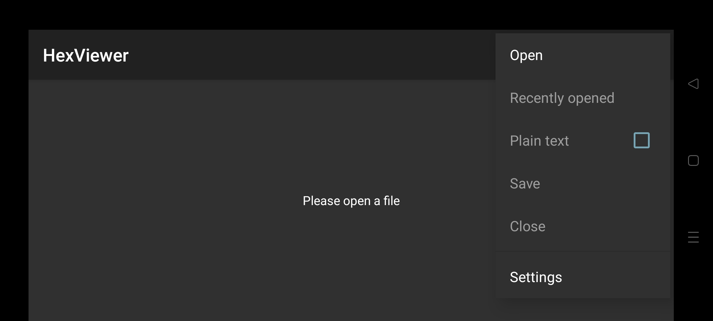
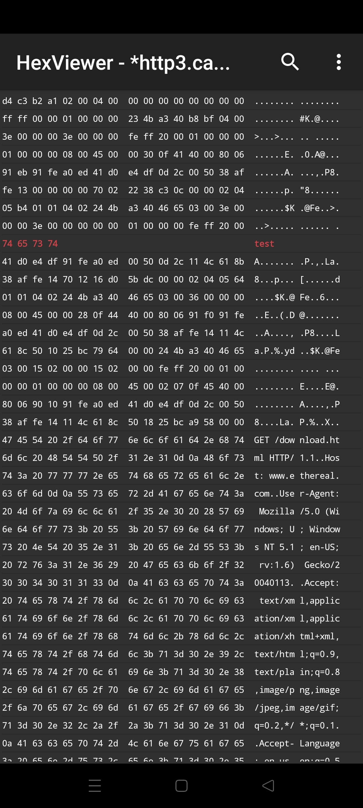
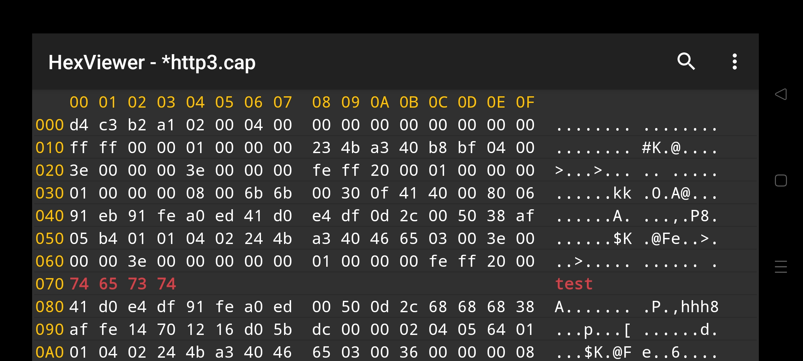
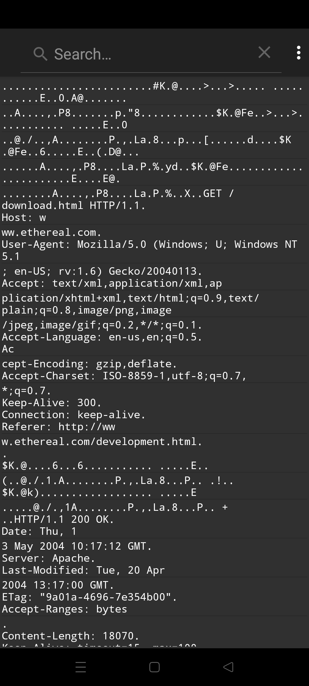

# HexViewer
[][travis]
[][codacy]
[][releases]
[][license]

(GPL) Android Hex Viewer is a FREE software.

This software is distributed in the hope that it will be useful, but WITHOUT ANY WARRANTY.

This application offers the following features:
*   Opening all files without a corresponding Android application (1).
*   Display of the file in hexadecimal (or plain text) with the possibility to modify the content (in hexadecimal only).
*   Saving the file on the smartphone/tablet (2).
*   Search option in the open file (hexadecimal and plain text modes).

(1) At first, the file can only be saved via "save as" and due to Android permissions reasons, the only way to make it appear in the list of recent files is to reopen it.
(2) Due to file permissions, after a "save as", the list of recent files cannot be updated with the new file location.

Caution: Opening files that are too large seriously degrades application performance and can suddenly stop the application on low-resource devices.

## Instructions
Download the software :

	mkdir devel
	cd devel
	git clone git://github.com/Keidan/HexViewer.git
	cd HexViewer
 	Use with android studio 
  
## Translations
*   Chinese: [@sr093906](https://github.com/sr093906) 
*   English: [@Keidan](https://github.com/Keidan)
*   French: [@Keidan](https://github.com/Keidan)
*   Russian: [@OmlineEditor](https://github.com/OmlineEditor)
*   Spanish: [@sguinetti](https://github.com/sguinetti)
	
## Screenshots

## License
[GPLv3](https://github.com/Keidan/HexViewer/blob/master/license.txt)

[travis]: https://travis-ci.com/Keidan/HexViewer
[releases]: https://github.com/Keidan/HexViewer/releases
[codacy]: https://www.codacy.com/gh/Keidan/HexViewer/dashboard?utm_source=github.com&amp;utm_medium=referral&amp;utm_content=Keidan/HexViewer&amp;utm_campaign=Badge_Grade
[license]: https://github.com/Keidan/HexViewer/blob/master/license.txt
