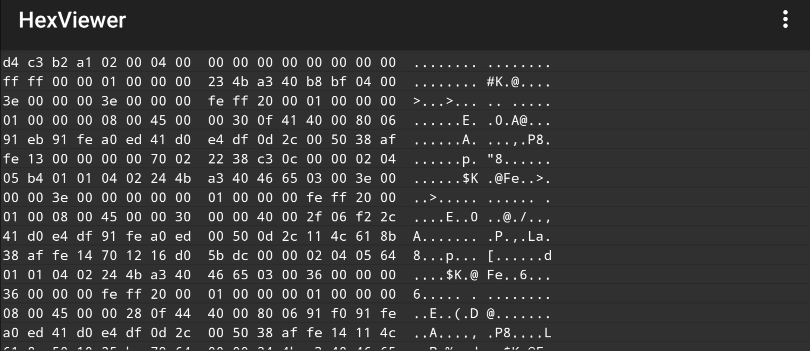
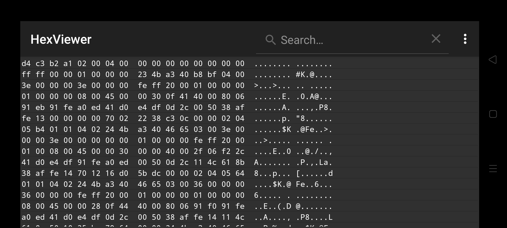
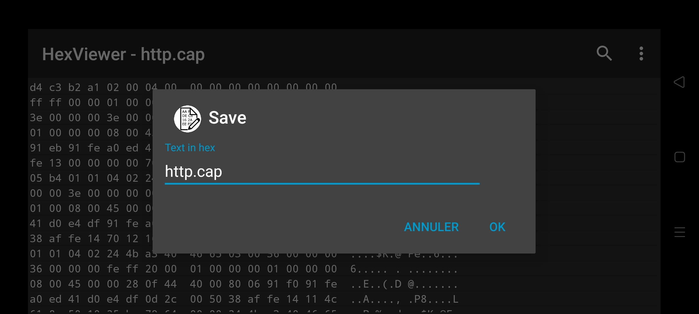

# HexViewer
[][build]
[][releases]
[][license]
[][weblate]
[][sonarcloud]
[][sonarcloud]
[][sonarcloud]
[][sonarcloud]
[][sonarcloud]
[][sonarcloud]
[][sonarcloud]
[][sonarcloud]
[][sonarcloud]

(GPL) Android Hex Viewer is a FREE software.

This software is distributed in the hope that it will be useful, but WITHOUT ANY WARRANTY.

This application offers the following features:
*   Opening all files without a corresponding Android application (1).
*   Display of the file in hexadecimal (or plain text) with the possibility to modify the content (in hexadecimal only).
*   Saving the file on the smartphone/tablet (2).
*   Search option in the open file (hexadecimal and plain text modes).

(1) At first, the file can only be saved via "save as" and due to Android permissions reasons, the only way to make it appear in the list of recent files is to reopen it.

(2) Due to file permissions, after a "save as", the list of recent files cannot be updated with the new file location.

_Caution: Opening files that are too large seriously degrades application performance and can suddenly stop the application on low-resource devices._

**WARNING:** This application cannot open files larger than ~20 MB on recent smartphones and less for older smartphones.

**WARNING:** Searching within the plain text view may become excessively slow when handling large files.

:star2: A special thanks to [@OmlineEditor](https://github.com/OmlineEditor) for her patience and help :pray:, without her this application would not be at this level :blush:.

## Instructions
Download the software :

	mkdir devel
	cd devel
	git clone git://github.com/Keidan/HexViewer.git
	cd HexViewer
 	Use with android studio
	
## Contributions

### Bug fixes

You can simply report a problem via an issue, or even provide pull requests with fixes for a bug you discovered.

About the style of the code: Try to respect the original style as much as possible.

### Translations
You are invited to provide translations for the app. But there are some rules.
* Please translate only if you're **familiar with the nomenclature of the Android system**. If you're not sure, check the official documentation and see how it should be done.
* Contribute only if you commit to translating the **majority** of the strings. No one wants an application that is a mix of English and native language. I may remove translations, if they are not updated on new string resources.
* So that I can integrate it correctly, please give me the translation of the new language.

Translations can be provided via [Weblate][weblate].

Note: In the settings, the list of languages is sorted as follows (according to the alphabetical order of their codes):
| Code | Language | Contributors |
| ---- | -------- | ------------ |
| ar | Arabic | [@sec.xyx](https://hosted.weblate.org/user/sec.xyx/), [@amro](https://hosted.weblate.org/user/amro/) |
| bg | Bulgarian | [@Trunars](https://hosted.weblate.org/user/Trunars) |
| cs | Czech | [@hajdam](https://github.com/hajdam) |
| de-DE | German | [@iNtEgraIR2021](https://github.com/iNtEgraIR2021), [@eUgEntOptIc44](https://github.com/eUgEntOptIc44), (+DeepL) |
| en-US | English | [@Keidan](https://github.com/Keidan), [@comradekingu](https://github.com/comradekingu) |
| el | Greek | [@VisionR1](https://github.com/VisionR1) |
| es-ES | Spanish | [@sguinetti](https://github.com/sguinetti), @gallegonovato (from weblate), (+DeepL) |
| fa | Persian | [@qaria185-blip](https://github.com/qaria185-blip) |
| fr-FR | French | [@Keidan](https://github.com/Keidan), [@Edanas](https://hosted.weblate.org/user/Edanas/) |
| hi | Hindi | @Shopimisrel (from github) |
| hu-HU | Hungarian | [@SziaTomi](https://github.com/SziaTomi) |
| in-ID | Indonesian | @Velorixen (from github) |
| it-IT | Italian | [@eUgEntOptIc44](https://github.com/eUgEntOptIc44) |
| iw | Hebrew | @Shopimisrel (from github) |
| ja-JP | Japanese | [@gnuhead-chieb](https://github.com/gnuhead-chieb) |
| nb-NO | Norwegian Bokmål | [@comradekingu](https://github.com/comradekingu) |
| nl-NL | Dutch (Nederlands) | [@AudeBelgraver](https://hosted.weblate.org/user/AudeBelgraver/) |
| ota | Turkish (Ottoman) | [@bgo-eiu](https://github.com/bgo-eiu) |
| pt-BR | Portuguese (Brazil) | [@Bardock88](https://github.com/Bardock88), @pedrolinharesmoreira (from github) |
| pt-PT | Portuguese | [@SantosSi](https://github.com/SantosSi) |
| ru-RU | Russian | [@OmlineEditor](https://github.com/OmlineEditor), [@AHOHNMYC](https://github.com/AHOHNMYC), [@racingrebel](https://github.com/racingrebel), [@Usland123](https://github.com/Usland123) |
| ta-IN | Tamil | [@TamilNeram](https://github.com/TamilNeram) |
| tr-TR | Turkish | @ersen0 (from github) |
| vi-VN | Vietnamese | [@unbiaseduser](https://github.com/unbiaseduser) |
| zh-CN | Chinese | [@sr093906](https://github.com/sr093906), @alchemillatruth (from weblate), @hamburger1024 (from weblate), [@inworless](https://github.com/inworless), [@hamburger2048](https://hosted.weblate.org/user/hamburger2048/) |

The current status of the translations is as follows:

[][weblate]

## Contributors

Thanks to all the people who make this project possible :purple_heart:

[See the full list][contributors]

## Screenshots

## License
[GNU GPL v3 or later](https://github.com/Keidan/HexViewer/blob/master/license.txt)

[build]: https://github.com/Keidan/HexViewer/actions
[releases]: https://github.com/Keidan/HexViewer/releases
[license]: https://github.com/Keidan/HexViewer/blob/master/license.txt
[weblate]: https://hosted.weblate.org/engage/hexviewer/
[sonarcloud]: https://sonarcloud.io/summary/new_code?id=Keidan_HexViewer
[contributors]: https://github.com/Keidan/HexViewer/blob/master/CONTRIBUTORS.md
